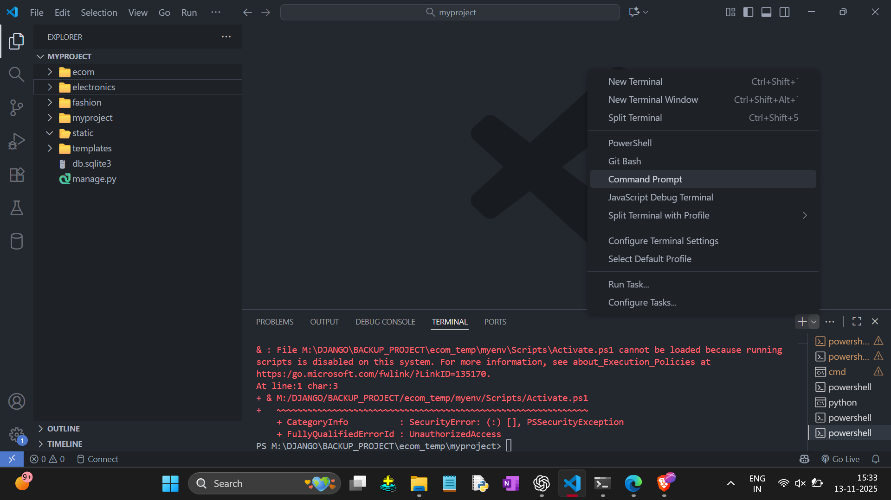
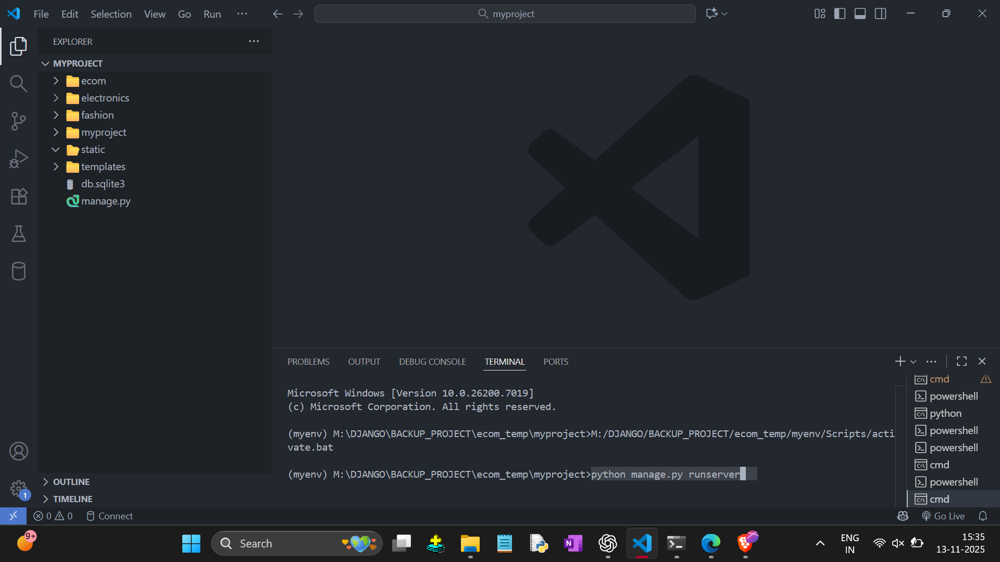
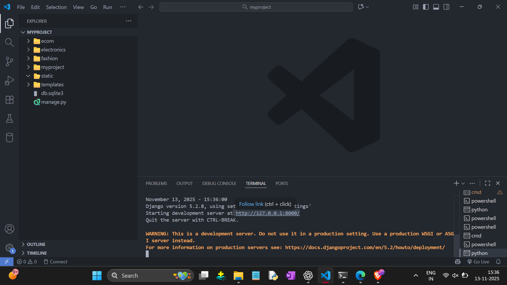

SETTING UP ENVIRONMENT AND CREATING NEW PROJECT

- Create Folder Ex. `'firstProject'`
- Open CMD (Commanda Prompt) then Type Following Commands

`1) python -m venv myenv  ( It Creates 'myenv' Folder )`  
`2) myenv\Scripts\activate`  
`3) pip install django`  
`4) django-admin startproject myproject  ( 'myproject' is a Project Name : It Display as a Folder )`  
`5) cd myproject`  
`6) code .`  
   
- When we type (` code . `) then VS Code will be Open.
- Then Open New Terminal and Select Command Prompt. 

      
 
- Then Type : `python manage.py runserver`

      
  
- Click on Given Link

    

Done..

    

