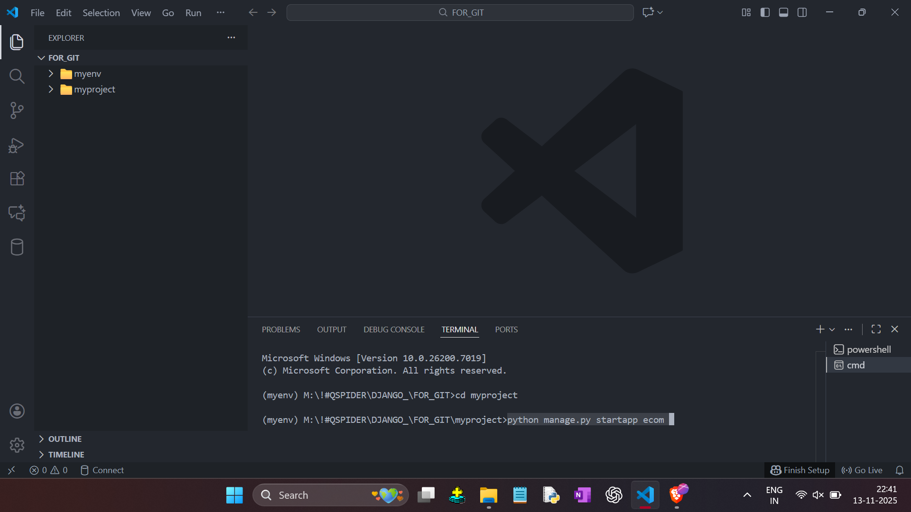
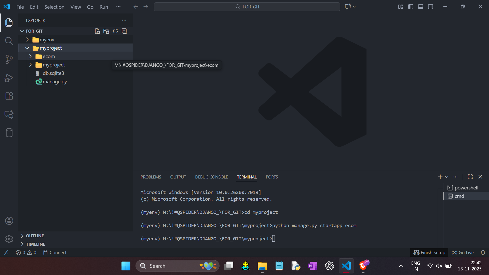
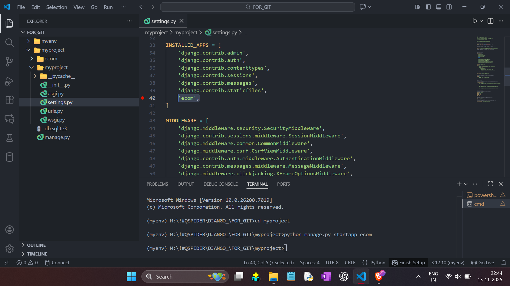

----- APP CREATION -----

- Open Terminal in Command Prompt
- Type: `python manage.py startapp ecom` ( Here 'ecom' is App Name )

    

- Then App will be Create.

    

- Go To `' settings.py '` in `myproject` File.
- Add app name `ecom` in `INSTALLED_APPS` List.

    
