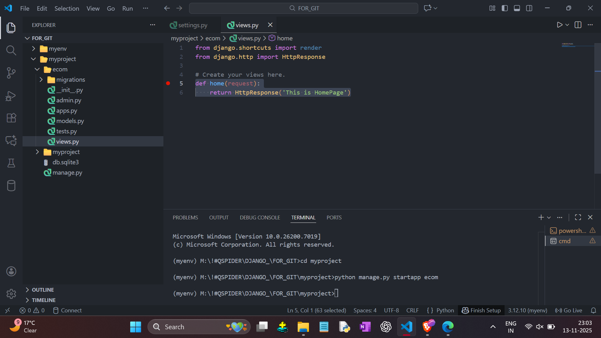

----- VIEWS CREATION -----

- Go To App `ecom`
- Go To `views.py`
- Add `from django.http import HttpResponse`
- Create Function ( Function is Also Called as Views )
- Chech Following Code and Create Function Like That ->

    

