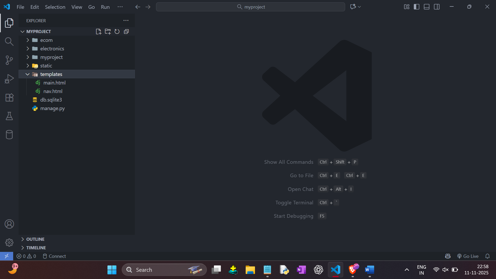
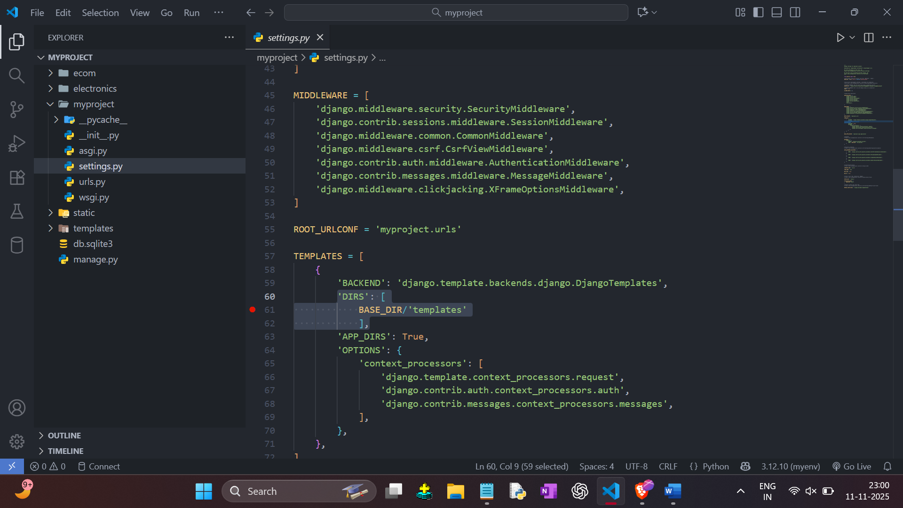

PROJECT LEVEL TEMPLATE
- Here we create a ‘templates’ Folder in a root directory.
- Then create main.html and nav.html in that file. [ IN ROOT DIRECTORY : templates ]
- Cut Pest all  ‘’ main.html and nav.html ’’ code in all apps and then pest it in a main.html and nav.html. [ If it is Already Created in Apps ]
- [ Pest Code in that file Which we recently created in templates folder outside the apps. ]  

- Then Go To setting.py and add Following :   
	'DIRS': [ 
       	    BASE_DIR/'templates' 
            ],  
[ Here Give the same name as a Folder Name, like ‘ templates ’ ] 

 

DOne..!
