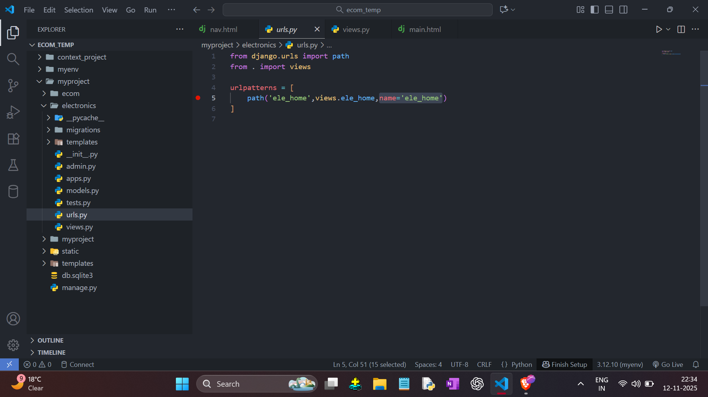
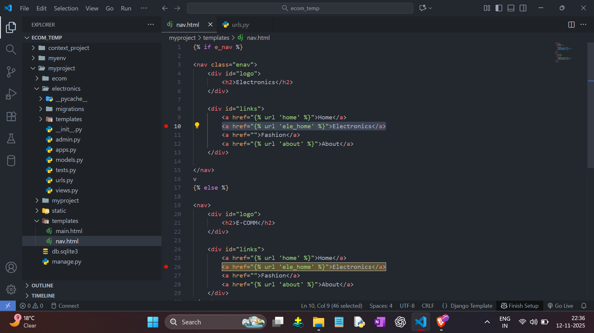

DYNAMIC URL ROUTING

- Go To 'urls.py' [ In All App ]
- Add Third Argument 'name'. [ name=' ' ]
- Give the name for this URL.   

   

- Go To 'nav.html' File
- Add this name like this  

`<a href="">Electronics</a>`
  
  
